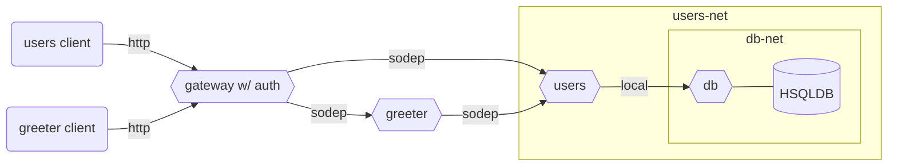

# Architecture

```mermaid
graph LR
	subgraph users-net
		direction TB
		users{{users}}
		subgraph db-net
			db{{db}}
			data[(HSQLDB)]
			db---data
		end
		users--local-->db
	end

	gateway{{gateway w/ auth}}
	gateway--sodep-->users
	client-users(users client)
	client-users--http-->gateway
	
	greeter{{greeter}}
	greeter--sodep-->users
	gateway--sodep-->greeter

	client-greeter(greeter client)
	client-greeter--http-->gateway
```

# Launch

- `(cd ../../greeter/by-username && jolie main.ol)`
- `(cd ../../users/with-db-sodep && jolie main.ol)`
- `jolie main.ol`
