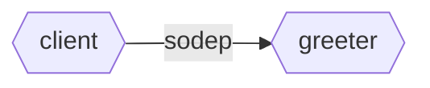
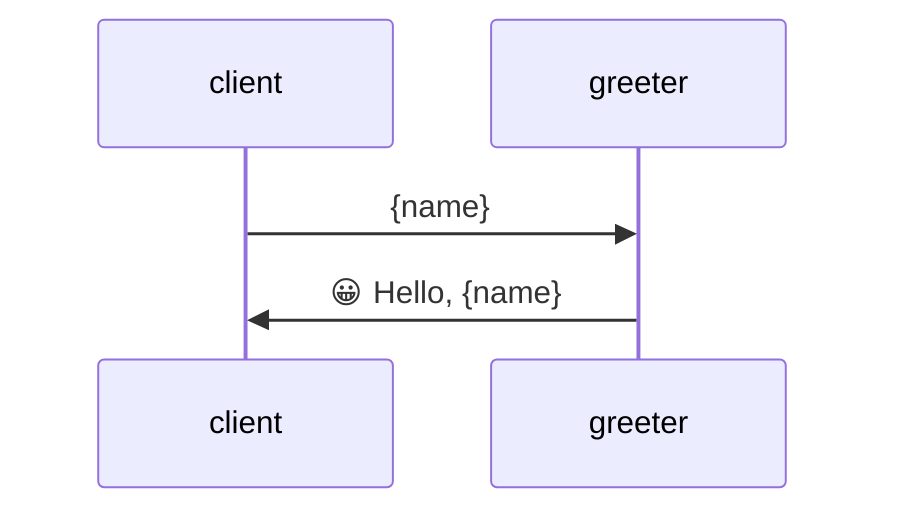

# Description

A client calling a greeter service to get a greeting for a given name.

# Architecture

```mermaid
graph LR
	client{{client}}
	greeter{{greeter}}

	client--sodep-->greeter
```

# Example Interaction

```mermaid
sequenceDiagram
    client->>greeter: {name}
    greeter->>client: 😀 Hello, {name}
```