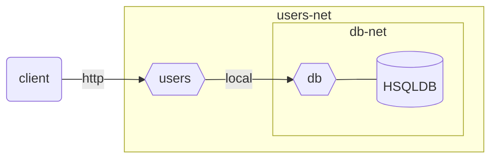

# Architecture

```mermaid
graph LR
	subgraph users-net
		direction TB
		users{{users}}
		subgraph db-net
			db{{db}}
			data[(HSQLDB)]
			db---data
		end
		users--local-->db
	end
	client(client)
	client--http-->users
```

# Setup
- `npm install`
- `jpm install`
- `jolie setup-db.ol`

# Launch
- `jolie main.ol`